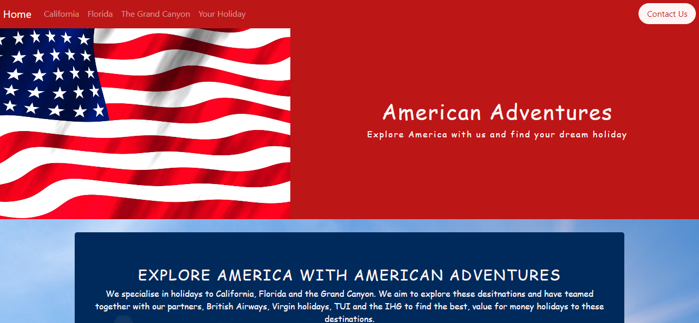
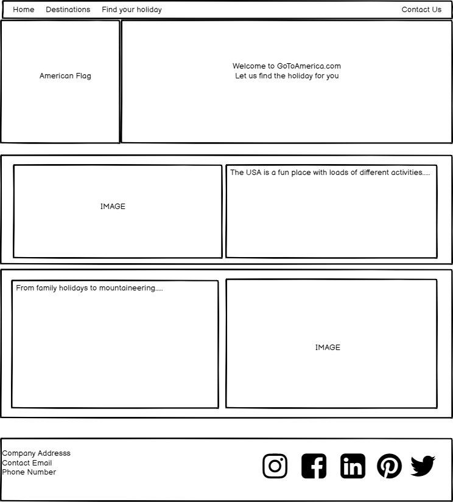
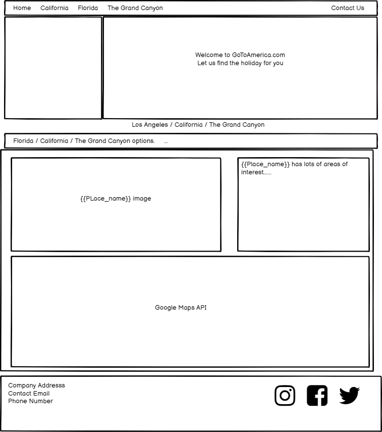
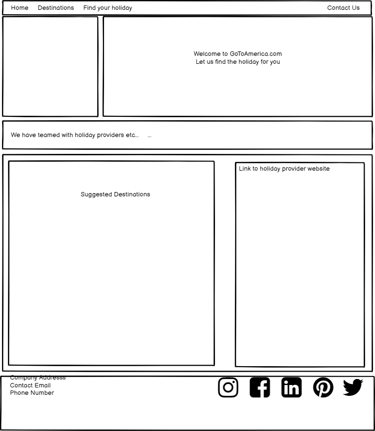
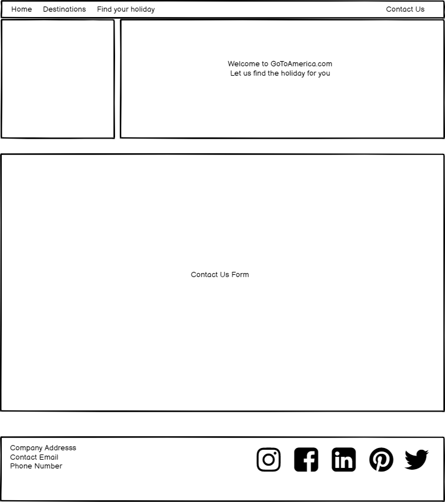

# AMERICAN ADVENTURES WEBSITE

This is a website for American Adventures. It is designed to be responsive and accessible on a range of devices to a large audience. It should be engaging and easy to navigate with some interactive usage to enhance the experience

## UX

* User Goals

        1. I want to go to the United States but I am unsure of where to go and what's on offer
        2. It should be easy for me to navigate the site and find out about this information.
        3. I would like to be able to investigate each available destination in detail and expect suitable tools to do so.
        4. I would like to have access to American Adventures social media accounts as well as be able to contact them easily through the site 

* Design

    * The site will contain classic colouring and imagery of the United states with a pleasant wallpaper of clear skies and sun to envoke the feeling of summer holidays.
    * I had wanted to use the sacramento font from google fonts but it has not worked so the backup but also pleasant cursive text has substituted. This is a light and fun font that brings a warm feel to the site.
    * I have used imagery across the site of major landmarks in America. These are instantly recogniseable (in some cases world famous brands) that people expect from America and aspire to going to 
    * The American flag is posted on the main banner on every page, it is the first thing you see and leaves little to the imagination as to what theme the site may be about

* Wireframes

    * Home page wire frame 
    

    
    

    * Destinations wire frame
    
 
    
    

    * Your holiday wire frame
    
 
    
    

    * Contact Us wire frame 
    

    
    

       
* Featured coding languages and Tools Used
    
    *HTML5
    *CSS
    * <a href="https://www.bootstrapcdn.com/">Bootstrap 4.5.2</a> - for styling, resposive grid settings and an interactive navbar using the bootstrap js library
    * <a href="https://www.bootstrapcdn.com/fontawesome/">Font awesome 4.7.0</a> - for social icons such as FB, twitter etc
    * <a href="https://fonts.google.com/">Google Fonts</a> - used to import IBM Plex Sans, Sacremento and cursive although the first two were not used. One through choice and one was not available
    * <a href="https://github.com/">Github</a> - used to push commits to for safe storing
    * <a href="https://gitpod.io/workspaces/">Gitpod</a> - used to create and commit to git before pushing to github
    * <a href="https://balsamiq.cloud/spaces">Balsamiq</a> - used to create wireframes
    * <a href="https://developers.google.com/maps/documentation">Google Maps</a> - used to enhance the users ability to explore destinations
    * <a href="https://www.emailjs.com/">Email.js</a>- used to receive emails and enquiries from users using the contact us page

## TESTING
    
* The W3C Markup Validator and W3C CSS Validator Services were used to validate every page of the project to ensure there were no syntax errors in the project.

    1. W3C Markup Validator for HTML and CSS - <a href="https://github.com/DJWOOLLEY84/Milestone-project-2/blob/master/Validator">Results</a> 
    2. I have tested all the jQuery links and contact us email form manually. I have also gone through all the maps and checked markers to see that they are presenting correctly.

* Testing User Goals

        1. The user is immediately greeted with a large title and american flag banner to indicate the purpose of the site. One of the nav-bar links is for "your-holiday" which re-enforces this.
        2. A jumbotron is present on the home page clearly setting out the purpose of the site - this is then backed up by testimonials supporting this case. 
        3. A clear and functional nav-bar is present on screen at all times with the fixed-top class. This allows the user to navigate through the site wherever they are on the page. As the bootstrap javascript plugin has been used the navbar takes minimal space on small devices.
        4. Each featured destination has a page dedicated to it. Using jQuery the user is able to flick through images and get more information about key areas of interest. Google Maps is visible on each page providing markers with key information about more areas.
        5. The your holiday page features a host of offers off trusted providers that are mentioned through the site which give links to their site to get the holiday.
        6. A contact us page has been installed where enquiries can be sent as well as social media channels also linked.

* Testing screen sizes and browsers
    * The site was tested through google, firefox and microsoft edge on two lap tops of differing sizes. It has been tested on all the different screen sizes on google with a bug creeping in on the spectacularly small Galaxy fold. The images could not quite centralise on this phone but I did not want to 
    make them any smaller for the sake of the overall look of the site.

* Bugs    
    * Again, a couplf of responsive issues on small screens. As stated above one was the galaxy fold issue which i have chosen to leave. The other was an issue with getting the table to fit for small phones. In this event I chose to remove the buy now button from small sizes but also make the holiday title clickable 
    so people can access it that way. 
    * There was a bug with email.js where the contact form would send the email when return: false was introduced BUT it would not reload the page and the text from the initial enquiry remained. To combat this, with the help of m mentor Gerry we redirected the sender to the home page once the email had been sent. 

## Deployment

* The project was deployed to GitHub Pages using the following steps...
    1. Logged in to GitHub and located my Milestone-Project-2 Repository
    2. Found the "Settings" Button on the menu at the top of the Repository page.
    3. Scroll down the Settings page until you locate the "GitHub Pages" Section.
    4. Under "Source", click the dropdown called "None" and select "Master Branch".
    5. The page will automatically refresh.
    6. Scroll back down through the page to locate the now published site link in the "GitHub Pages" section.

### Forking the GitHub Repository

* By forking the GitHub Repository we make a copy of the original repository on our GitHub account to view and/or make changes without affecting the original repository by using the following steps...
    1. Log in to GitHub and locate the GitHub Repository
    2. At the top of the Repository (not top of page) just above the "Settings" Button on the menu, locate the "Fork" Button.
    3. You should now have a copy of the original repository in your GitHub account.

* Making a Local Clone
    1. Log in to GitHub and locate the GitHub Repository
    2. Under the repository name, click "Clone or download".
    3. To clone the repository using HTTPS, under "Clone with HTTPS", copy the link.
    4. Open Git Bash
    5. Change the current working directory to the location where you want the cloned directory to be made.
    6. Type git clone, and then paste the URL you copied in Step 3.

    $ git clone https://github.com/YOUR-USERNAME/YOUR-REPOSITORY

    7. Press Enter. Your local clone will be created.

## Credits

* I had a real battle with Google maps and after a while of trying to get multiple marker windows to work I found a youtube tutorial which I watched plenty of times
before opting to use the code within it. This video is located at https://www.youtube.com/watch?v=Xptz0GQ2DO4&t=605s
* Also has help from Gerry mending the contact us page so that the contact form worked correctly